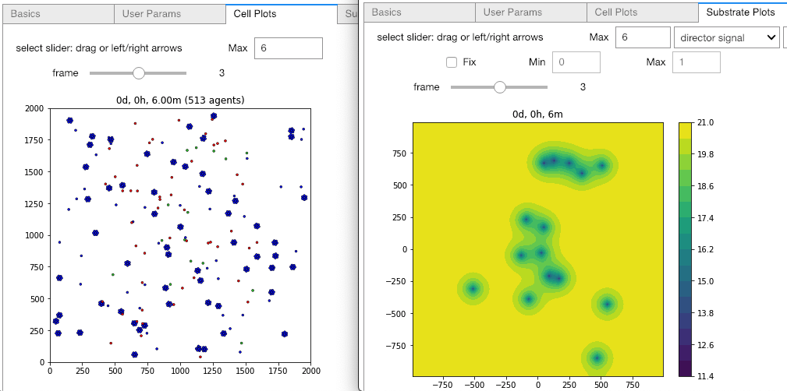
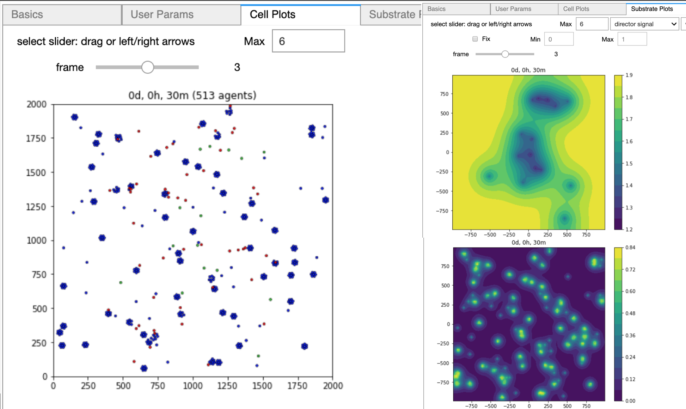

# Summary

Jupyter Notebooks [@Kluyver:2016aa, @Nature_2018_Jupyter] provide executable documents (in a variety of programming languages) that can be run in a web browser. 
When a notebook contains
graphical widgets, it becomes an easy-to-use graphical user interface (GUI).
Many scientific simulation packages use
text-based configuration files (hopefully in some standard format) to provide parameter values.
<!-- For many users, especially novice users, editing such a configuration file can be burdensome. -->
Xml2jupyter is a Python package that bridges this gap. It provides a mapping between configuration files, formatted in 
the Extensible Markup Language (XML), and Jupyter widgets. Widgets are automatically generated from the XML
file and these can, optionally, be incorporated into a larger GUI for a simulation package. 
Users modify parameter values via the widgets 
and the values are written to the XML configuration file. 
Xml2jupyter has been tested using the PhysiCell [@PhysiCell:2018] simulation software
and will be used by students for classroom and research projects.

A PhysiCell configuration file defines model-specific user parameters in XML. Each parameter element
consists of its name with attributes, defining its data *type* and *units* (optional), 
and the parameter's default value. The attributes will determine the appearance and 
behavior of the Jupyter widget. For numeric widgets (the most common type for PhysiCell), 
xml2jupyter will calculate a delta step size as a function of the default value and this 
step size will be used by the widget.

<!-- 
```xml
<user_parameters>
  <answer type="int" units="Triganic Pu">42</answer> 
  <author type="string">DNA</author>
  <enjoyed type="boolean">True</enjoyed>
</user_parameters>
```
-->
To illustrate, we show the following contrived XML example, containing each of the four 
allowed data types (currently): 


When we map this into Jupyter widgets, we obtain the following rendered result (left). The
middle snapshot shows the updated numeric value after the user does a single delta step (up) on the `radius` (note the step size of 10)
and the right snapshot after the user single steps the `threads` value (note the step size of 1).


In another example, we use an XML configuration file from the
*biorobots* sample project included with PhysiCell:

```xml
<user_parameters>
  <random_seed type="int" units="dimensionless">0</random_seed> 

  <!-- for microenvironment setup --> 
  <cargo_signal_D type="double" units="micron/min^2">1e3</cargo_signal_D>
  <cargo_signal_decay type="double" units="1/min">.4</cargo_signal_decay>
  <director_signal_D type="double" units="micron/min^2">1e3</director_signal_D>
  <director_signal_decay type="double" units="1/min">.1</director_signal_decay>
  
  <!-- for cell definitions -->
  <elastic_coefficient type="double" units="1/min">0.05</elastic_coefficient>
  ... 
  <director_color type="string" units="none">limegreen</director_color>
</user_parameters>
```

To demonstrate this project, one would: 1) clone the repository (or download a release), 
2) copy the sample XML configuration file to the root directory, 3) run the 
`xml2jupyter.py` script, providing the XML file as a argument.
```
$ cp config_samples/config_biorobots.xml .
$ python xml2jupyter.py config_biorobots.xml 
```
The `xml2jupyter.py` script parses the XML and generates a Python 
module, `user_params.py`, containing the Jupyter widgets, together with methods to populate 
their values from the XML and write their values back to the XML. 
To "validate" the widgets were generated correctly, one could, minimally, open `user_params.py` 
in an editor and inspect it.
<!-- One could then inspect it in an editor to "verify" it is correct.  -->

But to actually see the widgets rendered in a notebook, we provide a simple test:
```
$ python xml2jupyter.py config_biorobots.xml test_user_params.py
$ jupyter notebook test_gui.ipynb
```
This should produce the following notebook in your browser after selecting `Run all` in the `Cell` menu:


# PhysiCell Jupyter GUI

Our ultimate goal is to generate a fully functional GUI for PhysiCell users. Xml2jupyter provides one
important piece of this - dynamically generating widgets for custom user parameters for a model.
With other Python modules that provide additional components (tabs) of the GUI, common to all PhysiCell
models, a user can configure, run, and visualize output from a simulation.
<!-- (we currently assume the user will run the simulation from a shell window).  -->
Two tabs that provide
visualization of output files are shown below with results from the *biorobots* simulation.
Note that some of the required modules are not available in the Python
standard library, e.g., Matplotlib [@Hunter:2007] and SciPy.
We provide instructions for 
installing these additional dependencies in the repository README.

<!--



-->


<!-- 
-
The images above show hetero...  -->

# Extensions and Discussion

We hope others will be inspired to extend the core idea of this project to other text-based 
configuration files. XML is only one of several data-interchange formats. 
<!-- https://insights.dice.com/2018/01/05/5-xml-alternatives-to-consider-in-2018/ -->
It just happens to be the one of interest to us for PhysiCell.

While the additional Python modules that provide visualization are specifically tailored to PhysiCell
output, they can serve as templates for other file formats and provide similar functionality.
We welcome contributions, especially for three-dimensional data.

Xml2jupyter has helped us port PhysiCell-related Jupyter tools to nanoHUB [@nanoHUB_2013], 
a scientific cloud for nanoscience education and research that includes running 
interactive <!-- or batch --> simulations. For example, we show screen shots from our `pc4cancerbots`
tool running on nanoHUB, where the *User Params* tab has been generated using the 
`xml2jupyter.py` script. Readers can create an account on nanoHUB and run `pc4cancerbots` for themselves.


<!--


-->

In the four screenshots below, we show the cell plot tab (upper-left) and three different substrate plots.
This particular model and simulation is described in this [video](https://www.youtube.com/watch?v=wuDZ40jW__M).


We welcome suggestions and contributions (via GitHub pull requests) to xml2jupyter.
For example, currently, we arrange the generated parameter widgets in a single column, with (optional) descriptions of the
parameters. This is an appropriate layout for for an educational setting. But if a GUI will be used by just a single
researcher, for example, then it may be advantageous to generate a more compact layout of widgets.
Suggestions for additional visualization functionality are also welcome.
-->

# Acknowledgements

We thank the National Science Foundation (1720625) and the
National Cancer Institute (U01-CA232137-01) for generous support.
We acknowledge support from our collaborators at Purdue University, especially Martin Hunt, who 
helped port our Jupyter tools to nanoHUB.

# References

