# Summary

Jupyter Notebooks [@Kluyver:2016aa] provide executable documents (in a variety of programming languages) that can be run in a web browser. 
When a notebook contains
graphical widgets, it becomes an easy-to-use graphical user interface (GUI).
Many scientific simulation packages use
text-based configuration files (hopefully in some standard format) to provide parameter values.
<!-- For many users, especially novice users, editing such a configuration file can be burdensome. -->
Xml2jupyter is a Python package that bridges this gap. It provides a mapping between configuration files, formatted in 
the Extensible Markup Language (XML), and Jupyter widgets. Widgets are automatically generated from the XML
file and these can, optionally, be incorporated into a larger GUI for a simulation package. 
Users modify parameter values via the widgets 
and the values are written to the XML configuration file. 
Xml2jupyter has been tested using the PhysiCell [@PhysiCell:2018] simulation software
and will be used by students for classroom and research projects.

A PhysiCell configuration file defines model-specific user parameters in XML. Each parameter element
consists of its name with attributes, defining its data *type* and *units* (optional), 
and the parameter's default value. The attributes will determine the appearance and 
behavior of the Jupyter widget. For numeric widgets (the most common type for PhysiCell), 
xml2jupyter will calculate a delta step size as a function of the default value and this 
step size will be used by the widget.

<!-- 
```xml
<user_parameters>
  <answer type="int" units="Triganic Pu">42</answer> 
  <author type="string">DNA</author>
  <enjoyed type="boolean">True</enjoyed>
</user_parameters>
```
-->
To illustrate, we show the following contrived XML example, containing each of the four allowed data types: 

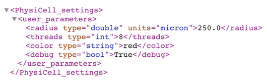

When we map this into Jupyter widgets, we have the following that shows the rendered widgets (left). The
middle snapshot shows the result after the user does a single delta step (up) on the `radius` (note the step size of 10)
and the right snapshot after the user single steps the `threads` (note the step size of 1).

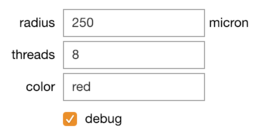
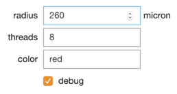
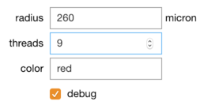

In another example, we use an XML configuration file from the
*biorobots* sample project included with PhysiCell:

```xml
<user_parameters>
  <random_seed type="int" units="dimensionless">0</random_seed> 

  <!-- for microenvironment setup --> 
  <cargo_signal_D type="double" units="micron/min^2">1e3</cargo_signal_D>
  <cargo_signal_decay type="double" units="1/min">.4</cargo_signal_decay>
  <director_signal_D type="double" units="micron/min^2">1e3</director_signal_D>
  <director_signal_decay type="double" units="1/min">.1</director_signal_decay>
  
  <!-- for cell definitions -->
  <elastic_coefficient type="double" units="1/min">0.05</elastic_coefficient>
  ... 
  <director_color type="string" units="none">limegreen</director_color>
</user_parameters>
```

A workflow to demonstrate this project is the following: 

* python xml2jupyter.py `<config_file>`.xml

A user would execute a Python script, `xml2jupyter.py`, that parses this XML and generates a Python 
module containing the Jupyter widgets, together with methods to populate their values from the XML
and write their values back to the XML. This can be displayed as a very simple GUI in a Jupyter
notebook to provide the mapping to/from the XML parameter values, as shown below:

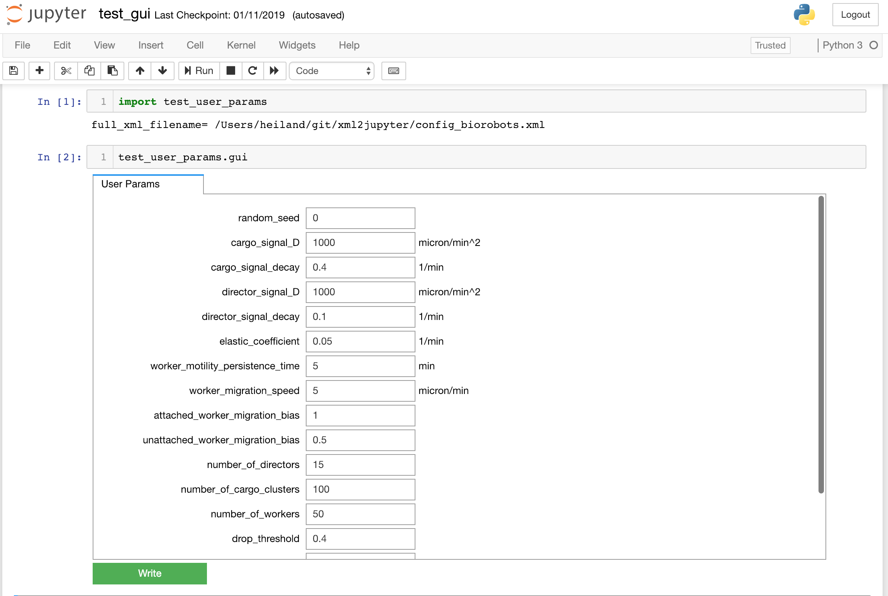


# PhysiCell Jupyter GUI

Our ultimate goal is to generate a functional GUI for PhysiCell users. Xml2jupyter provides one
important piece of this - dynamically generating widgets for custom user parameters for a model.
With the addition of static components (tabs) of the GUI, a user can also visualize output results
from simulations.
This additional functionality requires modules not available in the Python
standard library, e.g., Matplotlib [@Hunter:2007]
to display plots, and SciPy to parse PhysiCell output data. We provide instructions for installing these additional dependencies on
`github link`.

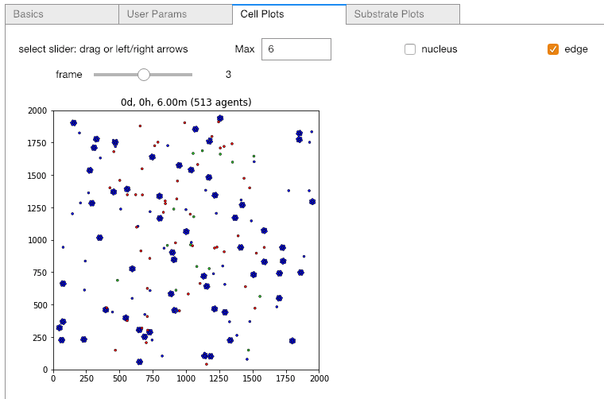


Additional tabs used by the PhysiCell Jupyter GUI.

<!-- 
-
The images above show hetero...  -->

# Extensions and Discussion
We hope others will be inspired to extend the idea of this project to other text-based 
configuration files. XML is only one of several data-interchange formats. 
<!-- https://insights.dice.com/2018/01/05/5-xml-alternatives-to-consider-in-2018/ -->
It just happens to be the one of interest to us for PhysiCell.

Xml2jupyter has helped us port PhysiCell-related Jupyter tools to nanoHUB [@nanoHUB_2013], 
a scientific cloud for nanoscience education and research that includes running 
interactive or batch simulations. For example, we show screen shots from our `pc4cancerbots`
tool running on nanoHUB, where the *User Params* tab has been generated using the 
`xml2jupyter.py` script. Readers can create an account on nanoHUB and run `pc4cancerbots` for themselves.

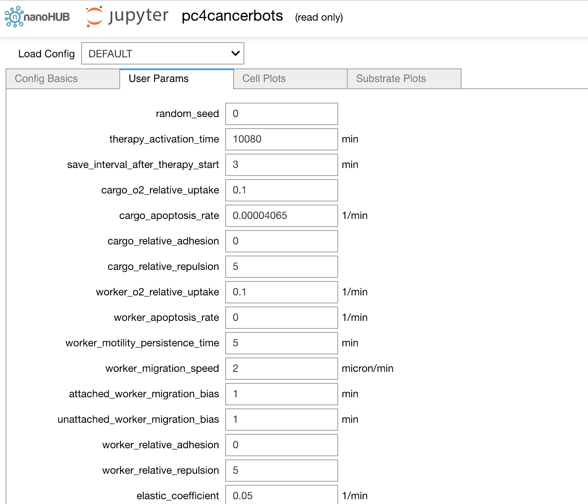

<!--
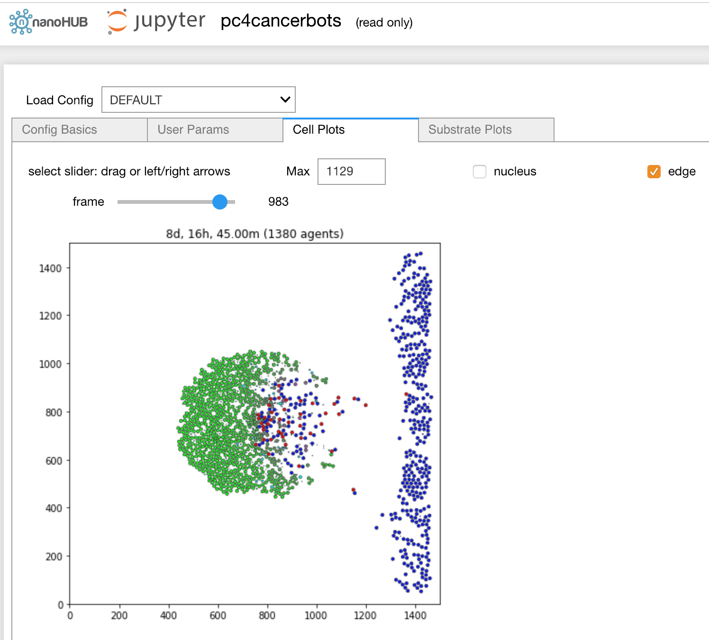

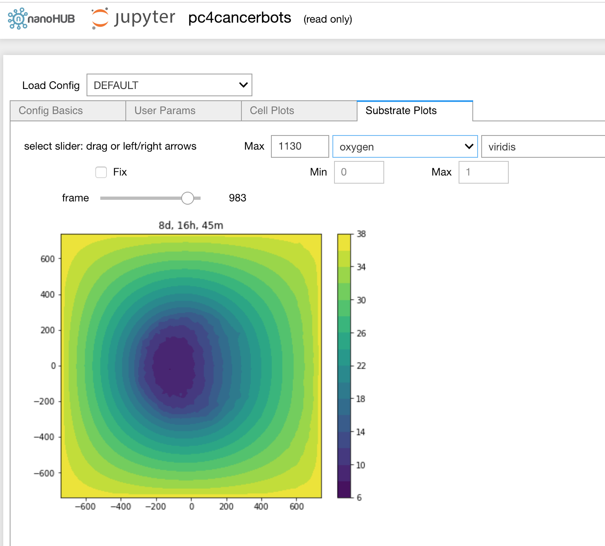

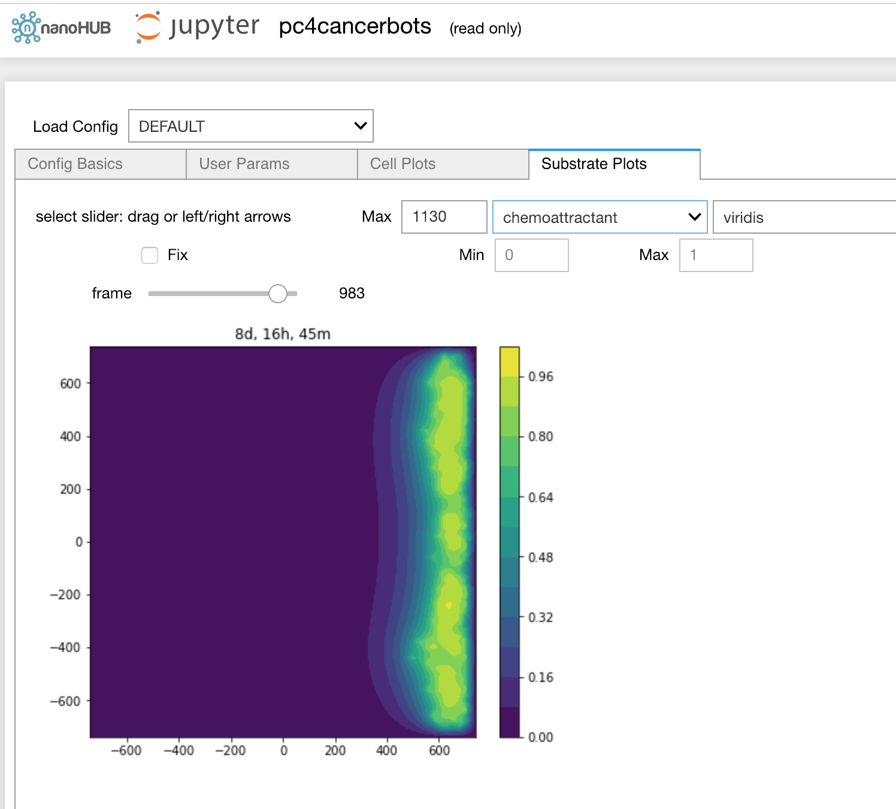

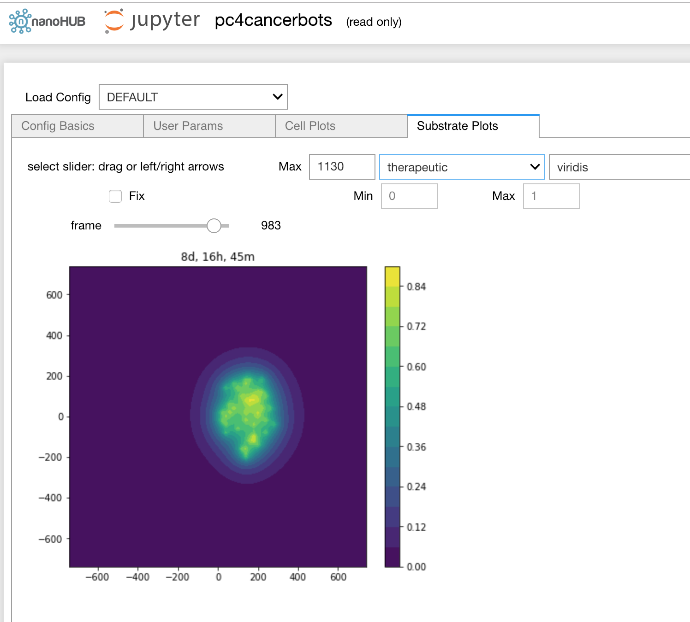
-->

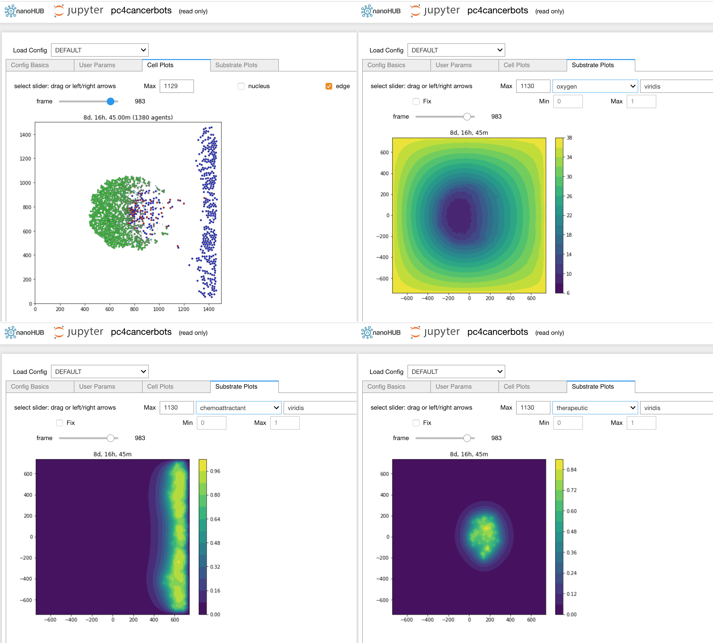

We welcome suggestions and, better yet, contributions (via pull requests) to xml2jupyter.
For example, currently, we simply arrange the generated widgets in a single column.
It may be preferable to allow a matrix-style layout, using additional attributes in the XML.
Also, it might be nice to provide more informative *tooltip* text for widgets.
# Acknowledgements

We thank the National Science Foundation for providing funding via NSF EEC-1720625.
NCI grant #... Paul?
We acknowledge support from our collaborators at Purdue University, especially Martin Hunt, who 
helped port our Jupyter tools to nanoHUB.

# References

